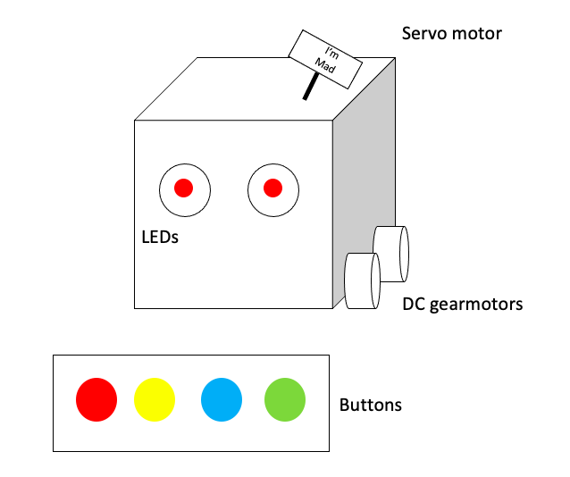
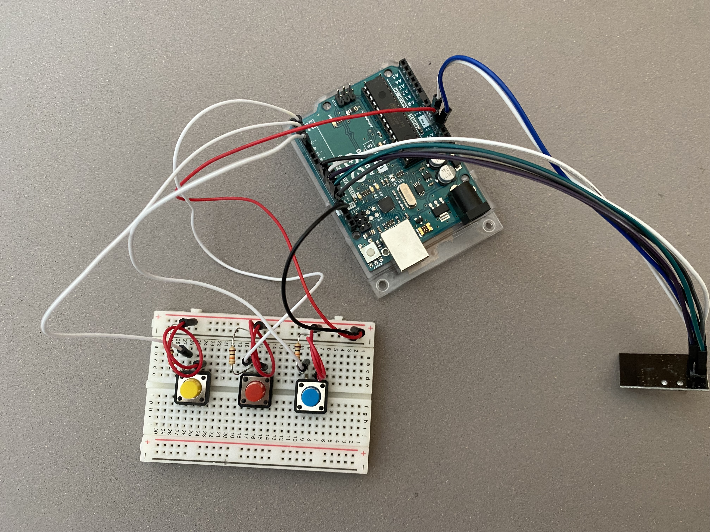
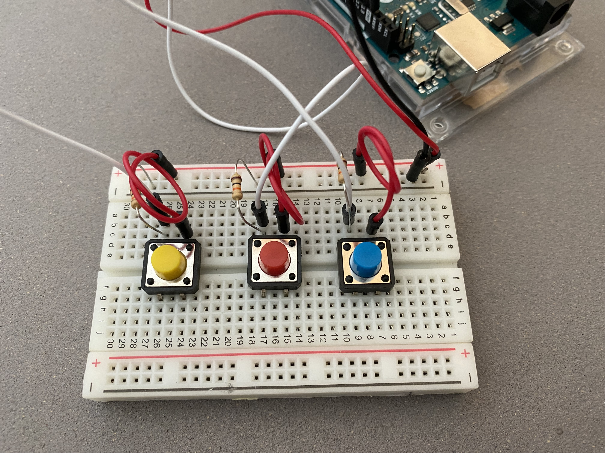
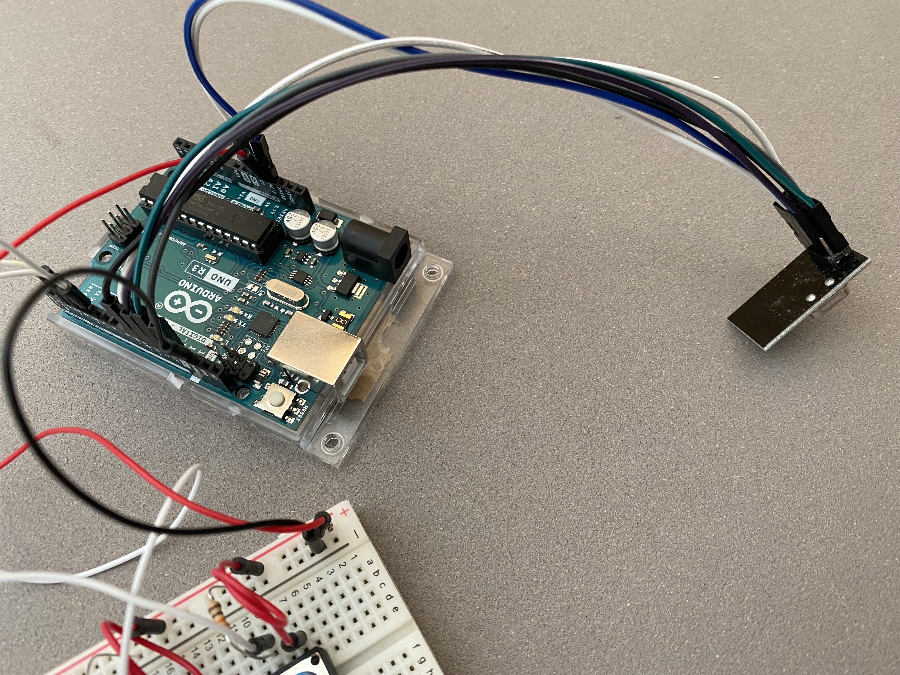
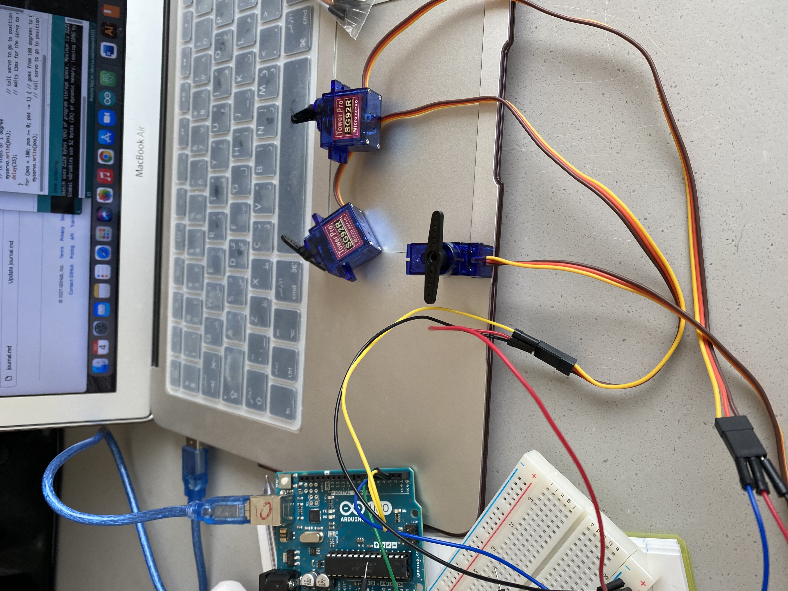
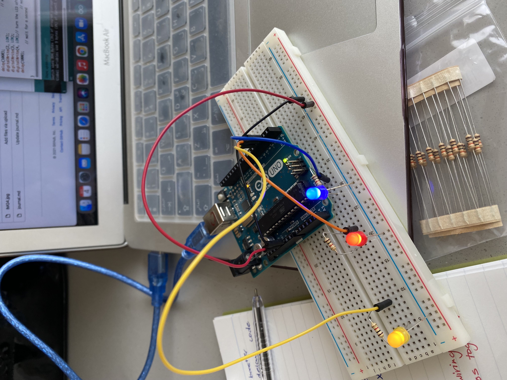
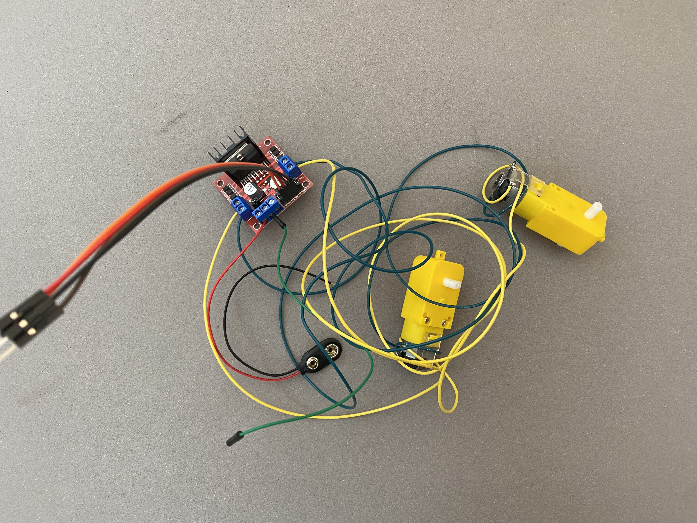
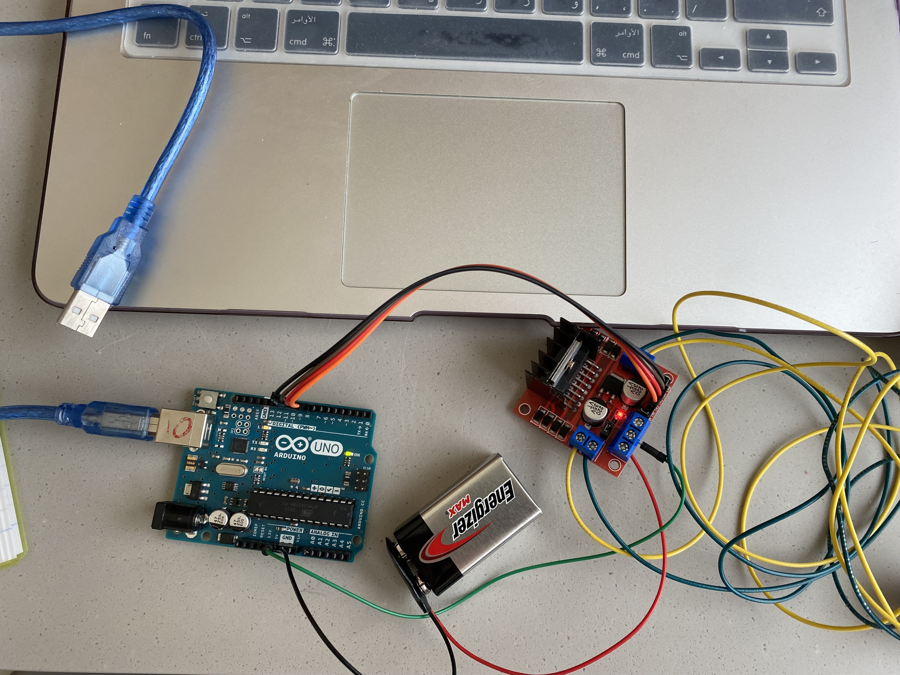
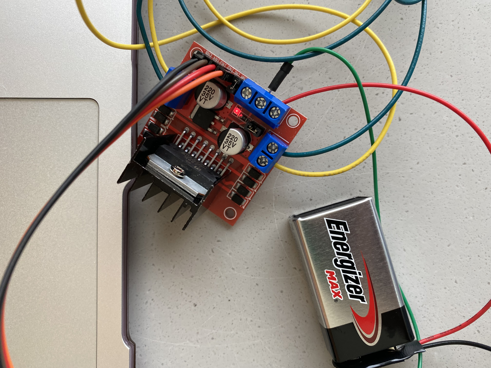
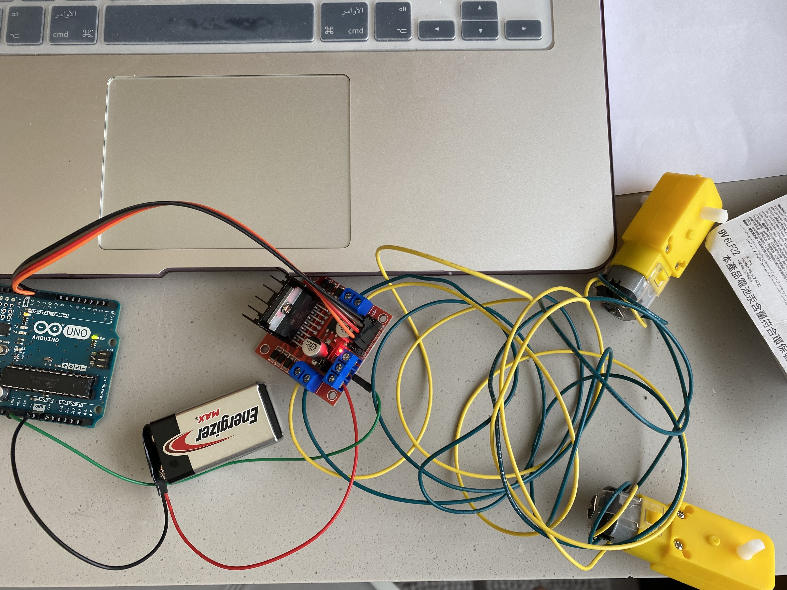

### Oct 3:

- Today I worked on brainstorming potential ideas I can work on for the project. I decided to create a figure that is controlled by different buttons. The figure will include colored LEDs, Servo motors, and DC gear motors. Once a button is triggered, the LED will turn on, the servo motor will move a signal, and the DC gear motors will move. Each button will trigger a certain expression depending on the color. For instance, if the red button was pushed, the red led will turn on, the Servo motor will move with a signal that holds the word I'm mad and the DC gear motor will move in a manner that shows that the figure is mad.

- An image of how the robot will kind of look like:

### Oct 4:

- Today I wired up all the components I needed and tested that they were working using the built-in example. I wired up the 3 buttons and test them out using the DigitalReadSerial example and they all worked. I attached the first radio to the Arduino that has the buttons connected and by that I had my first Arduino ready. The Arduino with the buttons will be that one used to control the working components attached to the other Arduino.

- This is how the first Arduino with the buttons and the radio turned out:

- I wired up the 3 Servo motors and tested them out using the Sweep example. They all worked.

- I wired up the LEDs and tested them out using the Blink example. They all worked.

- I finally soldered the other pair of DC gearmotors and connected them to the H-bridge to test if they worked. At first, the DC gearmotors didn't work. The H-bridge was powered but the red light on the H-bridge was very dim. I thought the issue was with the battery. However, it wasn't. I realzied that my Arduino was powered from the battery without it being connected to the laptop, that's when I figured out that there was something wrong with my wiring. It turns out the that the wire connecting the GND from the H-bridge was connected to the 5V on the Arduino. I got it fixed and connected the GND to the GND and by that it worked. I uploaded a simple code to test the DC gearmotors and they worked.

- The soldered DC gearmotors:

- The Arduino was powered from the battery:

- The H-brigde light was dim:

- Functioning DC gearmotors:

### Oct 5:

- Today I worked abit on getting my Arduino code to work or more specifically get the basis of my code done. I started with trying to understand how the radio trasmitter and reciever's code work. Although I didn't understand some lines the overall idea of the code somehow made sense. So I worked on getting the trasmitter code done, however, I'm still not sure if it works or not. 
- The discussion that was happening on Discourse about data and sequences was really helpful, it added to my understanding about how the code works.
