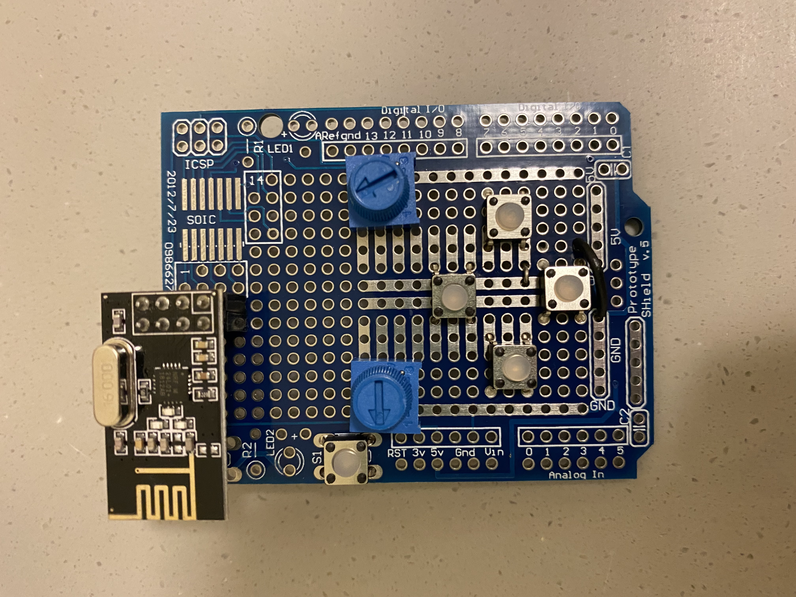
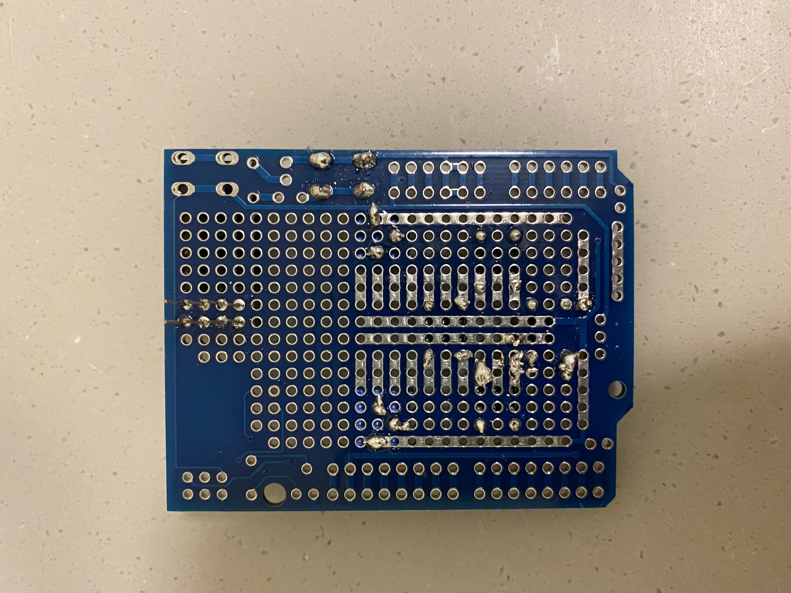

# Assignment 4: Reading Response + Idea + Prototyping Shield

## On Stage: Robots as Performers by Guy Hoffman

- Discussion slides: https://docs.google.com/presentation/d/127uCSMT-AcAO2PWfbU4H1jBvDQ9vziGUG7bpaWSLizQ/edit?usp=sharing

## Idea for a robot play

- One idea I had in mind was to show the relationship between Boston Dynamic Spot as a robot being trained by a robot. Something like the way humans train their dogs. Another idea was to create a play that shows what it would be like to have a robotic family. So maybe something like a baby robot, robot parents, and the robot dog. Also, a potential idea for a play would be a robot nanny and a robot dog taking a baby human to the park for a visit.
- I think the first idea would show maybe how robot to robot communication would be like - a robot training a robot or giving it some commands. As for the second idea, I think it can explore not topics that are difficult for humans, but maybe sensitive and taboo topics that humans and families, in general, tend to not talk about. Finally, the third idea can be used to explore human-robot coexistence, like how the robot nanny and robot dog would take care of a human baby while they are on a visit to the park. This is because in a normal scene we would see a nanny walking the dog and taking the kids to the park to play.

## Prototyping Shield

