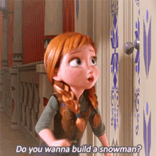

# Assignment 3: Questions Response

The scene I chose was from the film Frozen, "Do you want to build a snowman?". Click on this [link](https://youtu.be/WRsBMPnQYbQ) to see the scene I chose. The character I chose from this scene was Anna.

## Questions
- How would you build the actor?

Since the actor in the scene is a fictional human character, humanistic characteristics should be added to the robot version. The actor must have maybe some legs, arms, and eyes for movement and appearance. These humanistic parts can be built using plastic bottles and cardboard. Another possibility can be using an old doll to build the actor.

- What technical features will the actor need?

The actor would need some wheels to move around in the same way it moves in the scene. If not wheels, then something to make the actor move around the way it does in the scene. Also, the actor would need some movements in the arms and hands. This can happen by using Servo motors. Because in the scene, the actor sings and says some phrases, the robot version of it also has to sing or say something while performing the movements. Eyes and mouth are also some technical features that are needed for the actor. Whether they were just static or using a Neopixel and LEDs, they would add a lot to the character. This is because the actor in the film has a human’s physical appearance. 

- How will you construct the actor to create the role?

One of the main elements would be physical appearance. I believe with the physical appearances of the robot version of the actor, the actual character in the film will be easily known to the audience this way. In addition to the physical appearance, I believe that the actor would need to produce some sound or react with the sound in a certain way for it to be relatable to the audience. Sound or some kind of link to sound is needed because it can prove that the character is depicted by the robot is a human or has some human characteristics.

- How will you decorate or dress the actor for best effect?

The actor will be dressed in a dress. This is because the character is depicted in the film as a princess. If a dress can be accommodated, a crown only can be placed on the robot figure built to show that the character is a princess. Also, since the character is known for her orange braided hair and purple cape, both items or one of them can be placed on the robotic figure if possible to show that the robot is similar to the character in the film.

- What sequence of moves or other actions will you give your actor so that they can best play the part?

In the film, the actor moves around the room and acts in a childish way trying to call her sister to play with her. For the robotic version, a sequence of the actor moving around the space can be possible. For instance, the robot can turn around and move back and forth around the door. Also, moving the arms of the actor can be possible too. I am not sure about what component can be used, but it would be nice if the actor can sing or say phrases while doing the series of movements coded.

### This is the scene:

### This is the character:

