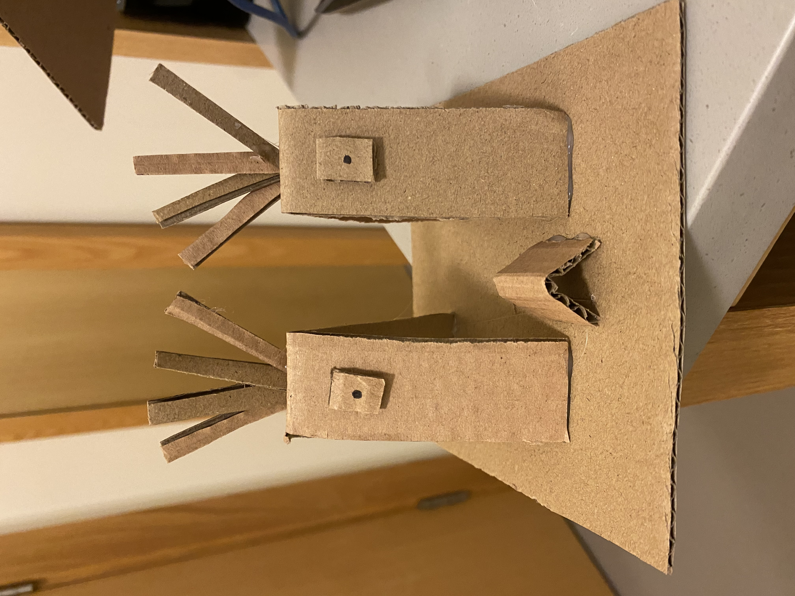
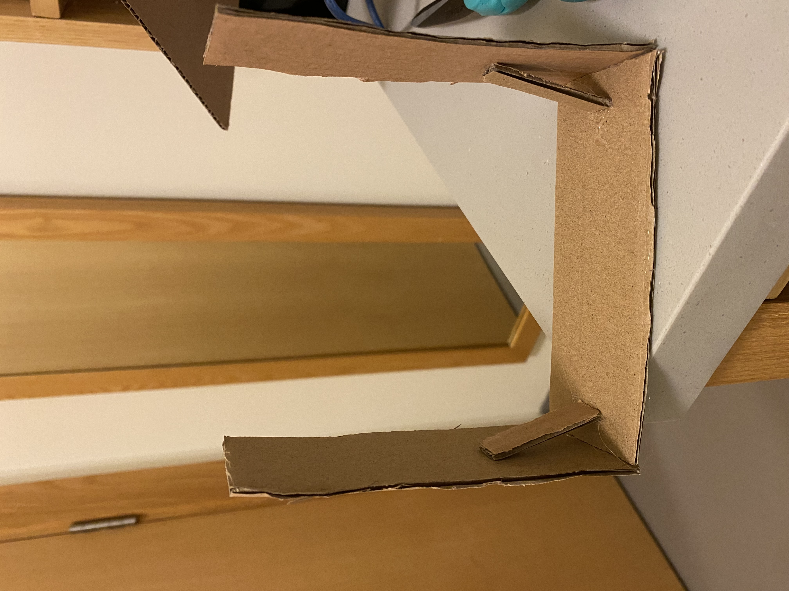
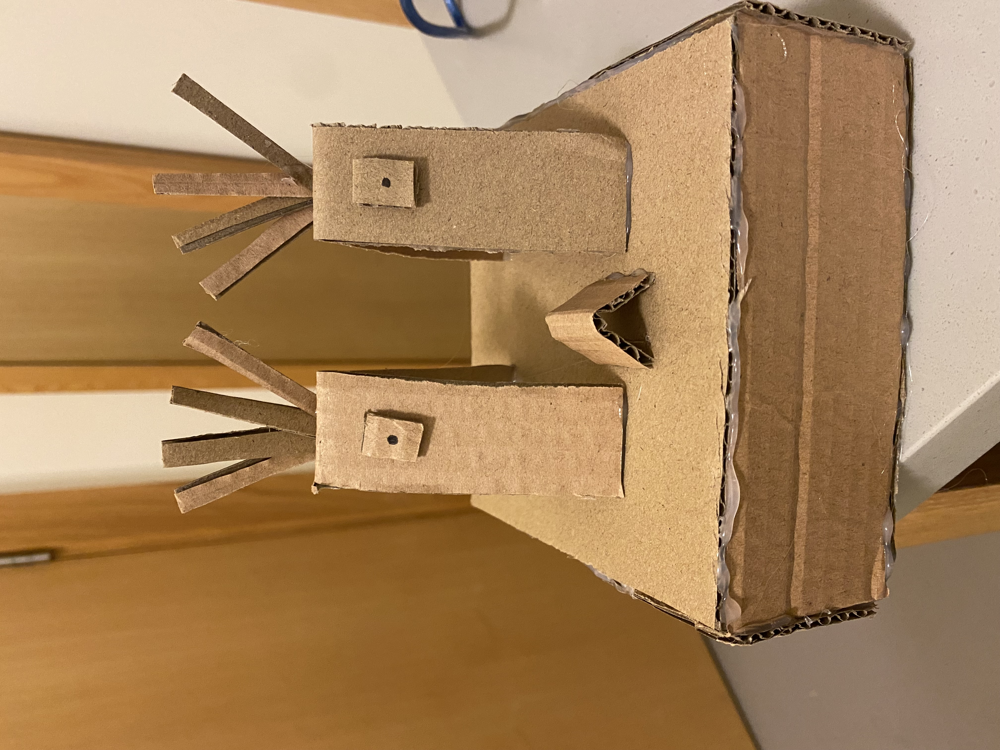
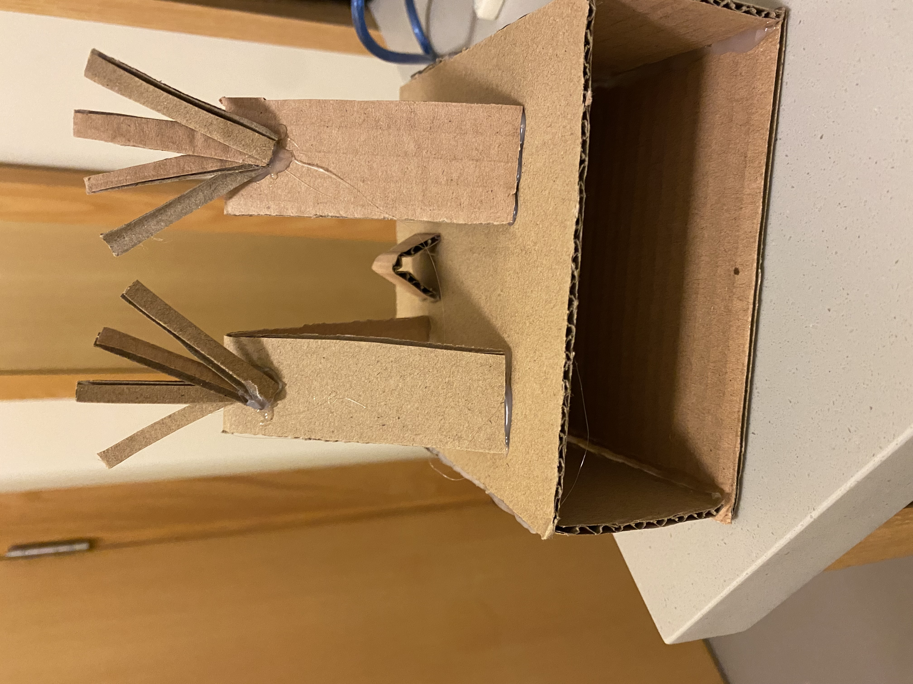
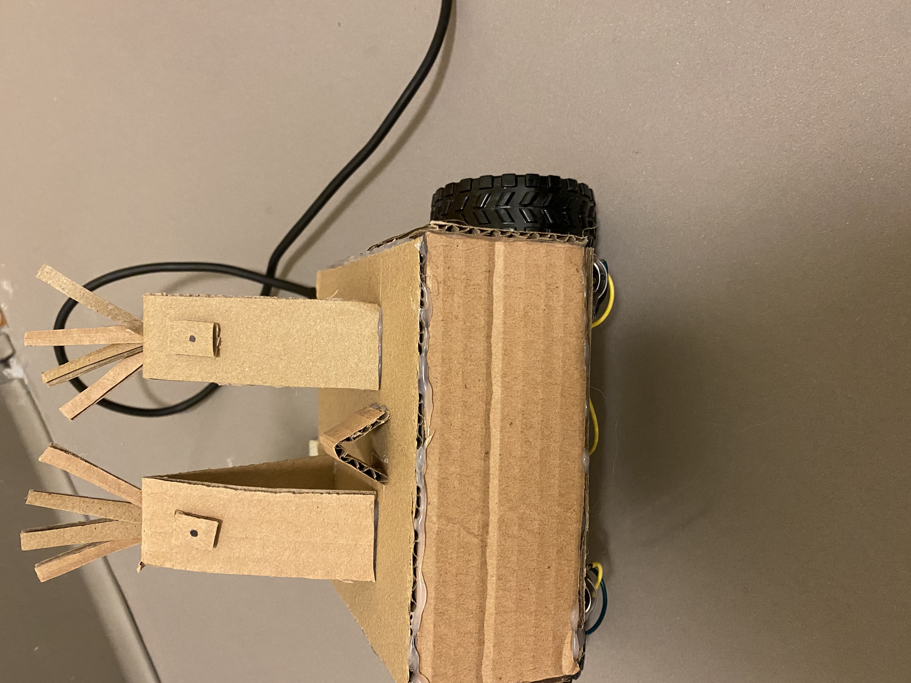
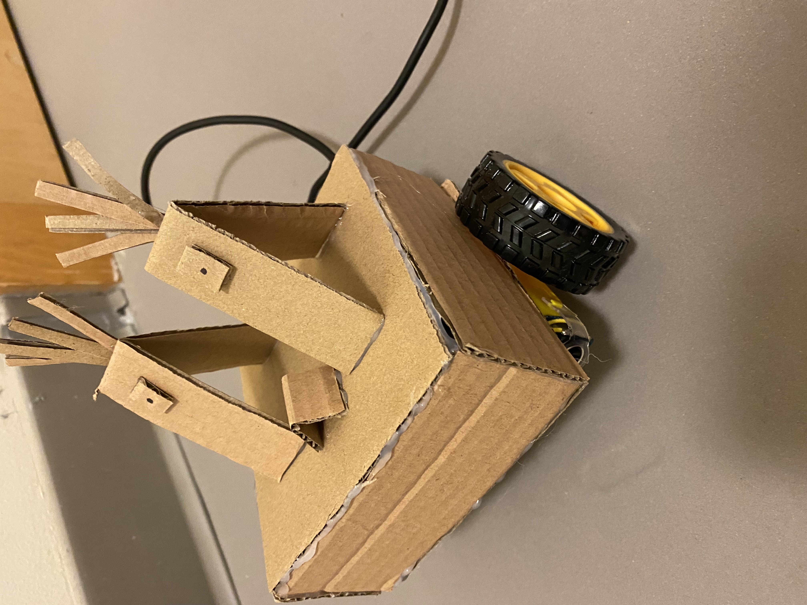
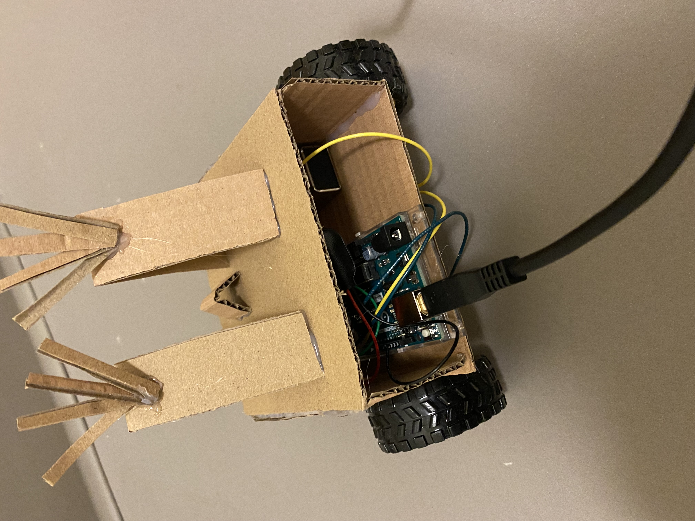

# Assignment 1: Robot Moving in Sequence

## Assignment Journey

### Definition of the word "robot":

- Based on this robot I created for this assignment; I define a robot being an object with different components programmed to perform in a certain manner, perform a certain task, or move and cause action in the desired way automatically. 

### Process:

- For the robot's physical appearance, I used what I created with the cardboard, last class. However, to allow the robot to hold the Arduino and the H-bridge of the motors, I created a small box under using the cardboard.
- The box was glued under the figure I had and carried all the extra components.
- The motors with the wheels were then glued under the box.
- Then a code was created to allow the robot to move forward and backward at different speeds.

### Process pictures:

### The story:

- The robot is programmed to move using the wheels connected to it forward for a couple of seconds and then backward for a couple of seconds at a certain low speed. Then the robot moves forward for a couple of seconds and then backward for a couple of seconds again but at a certain higher speed than the one used in the first round of moving forward and backward. This process of moving forward and backward at different speeds happens at a loop.

### The difficulties:

- At first, the robot didn't move nicely because I used only two wheels and there wasn't I great balance for the robot to stay still or move easily. I wanted to add another set of wheels for the robot to stay balanced, but the robot was small that another set of wheels would make it look a bit bulky and ugly. So what I did was that I glued the Arduino in a certain position inside the box I created to allow the robot to move smoothly. Although I didn't get the best result, it looked and moved better.

### Interesting things I discovered:

- When I uploaded the code the first time, the motor was moving in an undesired way or the way I wished it worked. The motor would move even when the delay command was there for it to stop. I thought there was something wrong with my code, however, the issue was that the battery's positive side was connected to the GND. 

### Video of robot

- A video of the robot moving can be found [here](https://drive.google.com/drive/u/0/folders/1iqlLajntSLyhIeDB-WeOJwqESZQFQ94U)
